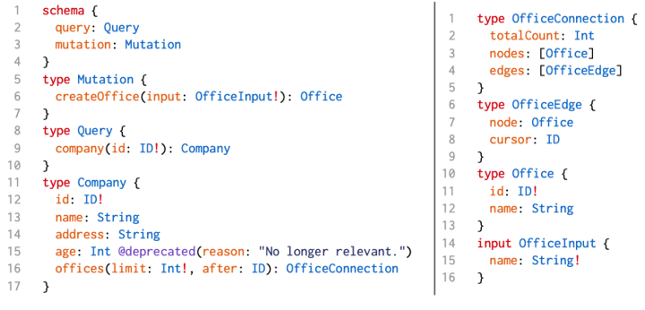
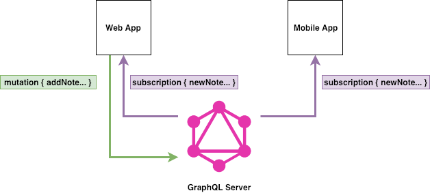

# GraphQL {data-background-image="1_-zPjDUowPUWGi91l7d0KOA.png" style="color: black"}

# 

<pre>
type GraphQL {
  что
  почему
  как
}
</pre>

# 

<b>Что такое GraphQL?</b>
<h3>"Рантайм и язык запросов для вашего API"</h3>

##

* 
Запросы GraphQL -> Ответы JSON
* 
Спецификация языка
* 
Описание схемы
* 
Запросы к схеме
* 
Реализация сервера/клиента

##

<b>Описание схемы</b>

<pre>
<sc>type</sc> User {
  <n>id</n>: <t>Int</t>
  <n>username</n>: <t>String</t>
  <n>first_name</n>: <t>String</t>
  <n>last_name</n>: <t>String</t>
  <n>friends</n>: <t>[User]</t>
}
</pre>

## 

<b>Описание схемы</b>

* 
Интерфейсы, Unions, Enums
* 
Поля, списки
* 
Скалярные значения: <pre class="fragment"><t>String</t>, <t>Float</t>, <t>Int</t>, <t>Boolean</t>, <t>ID</t>, <t>...</t></pre> 

##

<b>Операции</b>

<pre style="padding: 20px;" class="fragment">
<sc>query</sc> {
  search(<n>q</n>: "name") {
    <n>title</n>
    <n>author</n>
  }
}
</pre>
<pre style="padding: 20px;" class="fragment">
<sc>mutation</sc> {
  create(<n>title</n>: "My fancy book") {
    <n>id</n>
  }
}
</pre>
<pre style="padding: 20px;" class="fragment">
<sc>subscription</sc> {
  on_create() {
    <n>id</n>
    <n>title</n>
  }
}
</pre>

# 

<b>Почему GraphQL?</b>

## 

<b>Развитие GraphQL</b>

* 
2012 --- внутреннее использование в Facebook
* 
2015 --- OpenSource
* 
2018 --- GraphQL Foundation

## 

<b>Что учесть при создании API?</b>

* 
Эффективность
* 
Документация
* 
Real-time
* 
Интеграция

## 

<b>Эффективность</b>

* 
Overfetching --- слишком много данных, выкидываем часть запроса
* 
Underfetching --- слишком мало данных, делаем ещё запрос
* 
<i>Exactfetching</i> (GraphQL) --- всё, что нужно, ни больше ни меньше

## {data-background-color="white"}

## {data-background-color="white"}

## 

<b>Документация</b>

* 
GraphQL генерирует документацию из схемы
* 
Документация доступна по самому API

## {data-background-color="white"}

## 

<b>Real-time</b>

Пользователи хотят получать данные в реальном времени.

## {data-background-color="white"}

## 

<b>Интеграция систем</b>

GraphQL позволяет интегрировать разные системы в единый источник данных.

## {data-background-color="white"}

# Демо

# Итоги

## 

* 
GraphQL даёт:
  * 
Запросы
  * 
Подписки
  * 
Схему
  * 
Документацию
* 
Всё это можно сделать на REST
* 
Но GraphQL даёт удобные инструменты 